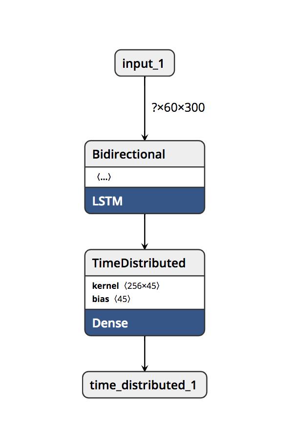
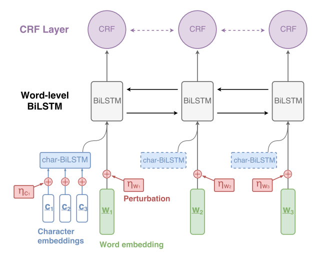

# NLP-Model-Experiment
A repository containing some experimentation with a few different variations of a specific BI-LSTM-CRF architecture implemented in Keras. 
The model was tested and evaluated on 3 different NLP tasks:
- Part of speech tagging (POS)
- Named entity recognition (NER)
- Noun phrase chunker

The model will be compared against the baseline and performances from the research paper ["Robust Multilingual Part-of-Speech Tagging via Adversarial Training"](https://arxiv.org/pdf/1711.04903.pdf) (from which the architecture was inspired)
as well as a custom baseline BI-LSTM model.

## Inspiration
The model architecture was inspired from the earlier referenced ["Robust Multilingual Part-of-Speech Tagging via Adversarial Training"](https://arxiv.org/pdf/1711.04903.pdf)
research original paper. The goal of this project strays from the scope of the paper; which focuses on adversarial training for improved performance. This project is simply an implementation of 
the vanilla baseline model for fun. Due to this, the model will only be trained and tested in English, rather than the multi-lingual model in the paper. Multi-lingual capabilities may be added in the future.

## Dataset
The model was trained and tested on the following datasets which were both referenced in the paper:
- [CoNLL 2000](models/data/CONLL2000) dataset for the POS and noun tasks
- [CoNLL 2003](models/data/CONLL2003) dataset for the NER tasks

The paper also includes the model's f1 score for both datasets and their respective tasks.

## Model
The BI-LSTM-CRF model architecture used is written in Keras because of the simplicity and speed of prototype implementation. 

###BI-LSTM Baseline
Along with the baseline present in the research paper, this project also uses a basic BI-LSTM model as additional baseline.
The baseline is also written in Keras.

###Baseline Architecture:

A simple BI-LSTM with time distributed fully connected layer.

###Model Architecture:

####Primary Model:
The BI-LSTM-CRF takes a sentence as it's GloVe word embeddings (w1, w2, w3) in addition to the corresponding character embeddings 
respectively for each word in that sentence (c1, c2, c3 for w1). Each word is represented by concatenating its word embedding and 
its character-level BI-LSTM output. It is then given to the main BI-LSTM-CRF network.
